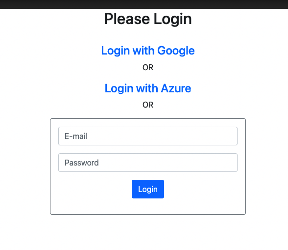

# Introduction
This application allows you to login via gmail. Its a simple spring boot application. 

# Getting Started

#Azure Ad Tenant Setup

Go to [Azure portal](https://portal.azure.com/)
<br/>

#Step 1 : Creating Our Web App
1. Browse to https://start.spring.io/.
2. Specify that you want to generate a Maven project with Java, enter the Group and Artifact names for your application.<br/>
3. Add Dependencies for Spring Web, Azure Active Directory, and Spring Security, Spring Data JPA, OAuth2Client, H2 Database<br/>
4. At the bottom of the page and click the Generate button.<br/>
#Step 2: Configuring Active Directory
##Creating Tenant
1. Sign in to the Azure portal<br/>
2. Now you have to create a tenant. Tenants are instances that provide access to an environment. More information can be found here.
3. Select “All resources”, and look for “Azure Active Directory” and click “Create a tenant”
4. Select “Azure Active Directory” option
5. Fill in your organization’s name, domain, and country, and you’re done!
6. You can now switch to your Active Directory tenant by clicking on the Switch Directory on the top menu.<br/>
   <br/>
##Registering the application :
1. In the left-hand navigation pane, select the Azure Active Directory service, and then select “App registrations” and create a new registration
2. In the Name section, enter a meaningful application name that will be displayed to users of the app
3. In the Supported account types section, select Accounts in any organizational directory.
4. Add http://localhost:8090 as the Reply URL under Redirect URI.
5. Select Register to create the application.
## Things to copy
1. In the “Overview”, note the “Application (client) ID”, this is what will be used in Spring Security as “client-id”, as well as the “Directory (tenant) ID”, which will be Spring Security’s “tenant-id”.These will be configured in the application.properties of this project<br/>
2. Select “Authentication” in the left navigation pane, and in the Web “Platform configuration”, check both options under “Implicit grant” (“Access tokens” and “ID tokens”)<br/>
3. Select “Certificates & secrets” in the left navigation pane, go to that page and in the Client secrets section, choose New client secret:
4. Type a key description (of instance app secret),
5. Select a key duration of either In 1 year, In 2 years, or Never Expires.
6. When you press the Add button, the key value will be displayed, copy, and save the value in a safe location.
You’ll need this key later to configure the project. This key value will not be displayed again, nor retrievable by any other means, so record it as soon as it is visible from the Azure portal.
## Setting Api Permissions
1. select “API permissions” in the left tab
2. Click on “Add a permission” button and then ensure that the Microsoft APIs tab is selected
3. In the Commonly used Microsoft APIs section, click on Microsoft Graph
4. In the Delegated permissions section, ensure that the right permissions are checked: Directory.AccessAsUser.All and “User. Read” permissions
5. Click on the “Grant admin consent” button at the bottom of the page
6. Select the Add permissions button
   <br/>
#Step 3: Configuring Users & Groups for your application
Still, in your Active Directory tenant, select “Groups” and create a new group, for example, “group1”.
Now select “Users”, create a new user, and give that user the “group1” group that we just created.
<br/>
#Step 4: Configuring your Spring boot Application
Extract the files from the project archive you created and downloaded it in the earlier steps into a directory.
Navigate to the src/main/resources folder in your project and open the application.properties files and configure the following properties which were recorded in the earlier steps.
```
### Specifies your Active Directory ID:
azure.activedirectory.tenant-id=4e5f4cb7–9489–4187–8217–515252fcb09e
### Specifies your App Registration’s Application ID:
spring.security.oauth2.client.registration.azure.client-id=0256cf7c-0e57–4305-a278-d9b2599798c9
### Specifies your App Registration’s secret key:
spring.security.oauth2.client.registration.azure.client-secret=80sZw5TbL?_1pAg-:oLig35TGz94RI=q
### Specifies the list of Active Directory groups to use for authorization:
azure.activedirectory.active-directory-groups=Academy
```


#Step 5: Setup the database

Open mysql workbench. Create a schema named sales.

Execute the scripts placed under /resources/initialdata.sql

Execute both the scripts.

update the database username password at resources/application.yml 

#Step 6: Build and Test
## Running the application.

Do a mvn clean install from the base directory
If youre on editor right click the ProductManagerApplication.java file and click run.

# Accessing this application
Open chrome browser and [open this link](localhost:8090)

You will see the login page with google link <br/>

<br/>

Click on the login with Azure

<br/>

Once logged in you will be able to access the application to add or remove products <br/>


# Contribute
# Implementation Reference url

https://www.codejava.net/frameworks/spring-boot/oauth2-login-with-google-example
https://medium.com/xebia-engineering/authentication-and-authorization-using-azure-active-directory-266980586ab8

